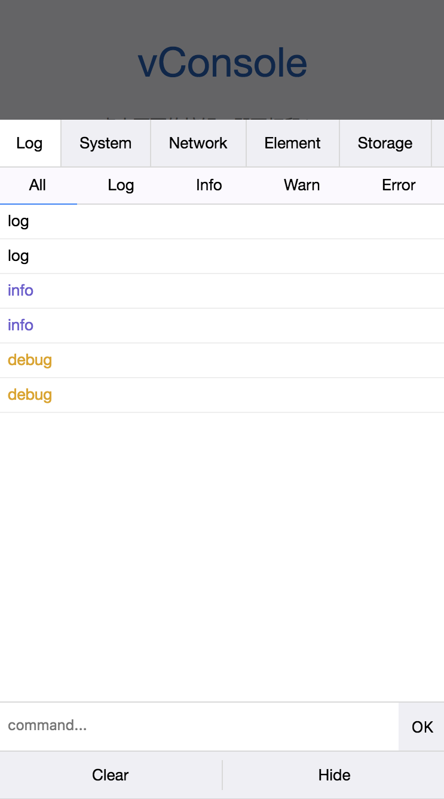
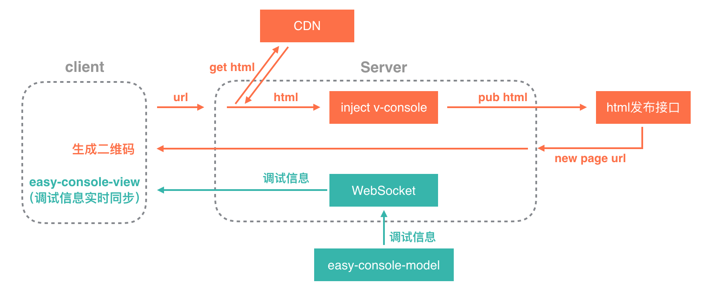

# easy-console-model

[](https://badge.fury.io/js/easy-console-model)

[](https://nodei.co/npm/easy-console-model/)

Easy Console 是一个H5页面调试工具，而 easy-console-model 用于获取调试信息，为调试工具提供数据

#### 线上H5页面问题排查现状

1、大部分场景来自于PM反馈，且只有特定手机可以复现，需要借手机

2、抓包https页面需要安装证书，即使抓包，也无法查看console

3、测试环境不支持https，发线上测试不符合流程

#### 问题

1、排查成本高，过程麻烦

2、新人无法立即上手排查，存在抓包工具、沟通门槛等限制

#### 解决

提供【远程调试服务】，支持对需要调试的页面，注入 **easy-console-model** ，[vConsole](https://github.com/Tencent/vConsole)，新发布一个html页面，用于调试。如下：

<p align="left">
    
</p>

同时，通过 `WebSocket` 将 **easy-console-model** 获取到的调试信息实时同步到【远程调试】的页面中，支持远程查看调试信息，远程进行问题排查。

整体实现思路如下：

<p align="left">
    
</p>

#### 效果

1、降低排查成本、简化排查过程、提高排查效率，一次问题排查：沟通、借手机、安装证书、抓包（时间：30min） → 生成调试页面 、扫描二维码、远程调试（时间：2min）

2、无需借手机，可以直接远程排查

#### 使用

##### 安装

``` bash
$ npm install easy-console-model
```

##### 使用

``` js
import easyConsole from 'easy-console-model';

// 注意，由于easyConsole数据中包含console数据，直接console.log(easyConsole)会形成死循环，可以通过JSON.stringify处理一下再打印出来
console.log(JSON.stringify(easyConsole)); 
```

**easyConsole** 中 `data` 字段包括 `console`, `network`, `element`, `storage` 信息，提供 `updateData` 方法对数据进行更新（`console`, `network` 数据是实时更新的，`element`, `storage` 数据需要手动调用 `updateData` 方法进行更新）

#### 实例

[DEMO](https://hujiaohj.github.io/easy-console-model/demo/dist/index.html)
